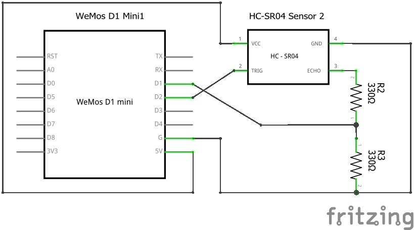
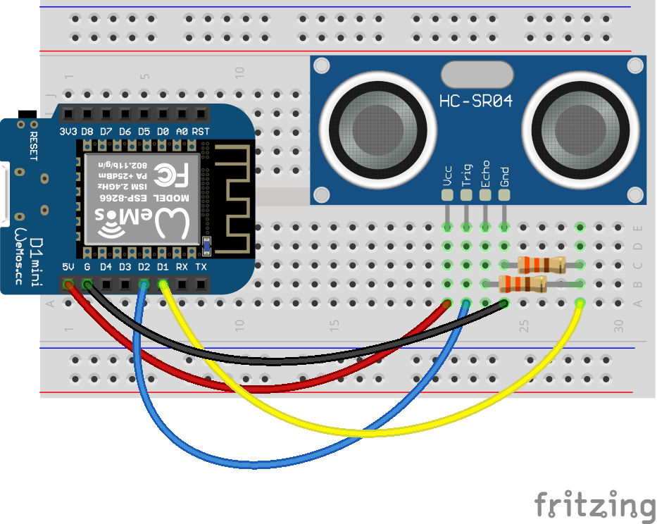

# Lab Exercise - ESP8266 and HC-SR04 Ultrasonic Distance Sensor

This lab will introduce students to the HC-SR04 distance sensor.

## Exercise 1

A guide to how the sensor works can be found here: https://lastminuteengineers.com/arduino-sr04-ultrasonic-sensor-tutorial/

Read the guide and then answer the questions below.

Q1. How does the sensor work?

Q2. What is the operating voltage of the sensor?

Q3. What are the limitations of the sensor?

## Exercise 2

Build and test a circuit using the sensor.

#### Components Needed
* HC-SR04 Ultrasonic sensor
* 330 ohm resister x2
* connecting wires
* breadboard
* ESP development board (e.g. Wemos D1 mini)

### Instructions

1. Wire up the components as shown in the diagrams.

    

     

    

    #### Default Pin Wiring

    | Pin No. | Function | Device Connection |
    | --- | --- | --- |
    | 5V | 5V | HC-SR04 VCC 5V |
    | D2 | GPIO 4 (SDA) | HC-SR04 Trig |
    | D1 | GPIO 5 (SCL) | HC-SR04 Echo |
    | G | GND | GND |

    

2. If using Arduino IDE: Open the [hc-sr04-distance-sensor](arduino/hc-sr04-distance-sensor/hc-sr04-distance-sensor.ino) sketch and run it.

   If using MicroPython: Import the contents of the micropython folder onto the D1 mini. Run the [`distance.py`](micropython/distance.py) script.

3. Open the serial monitor and check that the sensor is working correctly. 

## Exercise 3

### Problem

In order to maximise storage capacity in an automated car park, the parking robots need to park cars as close together as possible, without being too close and causing damage to the cars. It has been deduced that the optimum distance between cars is 10cm, while 5cm is too close.

Devise a solution that will alert the robots whenever cars are too close together.

### Instructions

1. Draw a circuit diagram with an LED added to your distance sensor circuit. (pen and paper will do, or MS Paint)

1. Build the circuit on a breadboard.

1. Add logic to your distance measuring code so that the LED lights whenever the distance is below the required threshold.

 

## Advanced Exercise 1

The speed of sound is effected by air temperature. Add a temperature sensor to your circuit and compensate for air temperature in your code.
